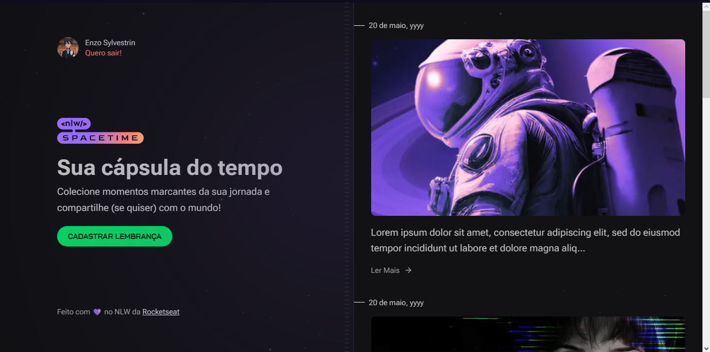

<h1 align="center">NlwSpaceTime</h1>




## Introdução

Esse é um projeto desenvolvido que conta com um server em node com fastify, um app com expo e um site com next.js, foi feito no Nlw da rocketseat.

## 💻 Pré-requisito

Antes de começar, verifique se você atendeu ao seguinte requisito:
* Você instalou a versão mais recente do Node.js

## ☕ Usando o Projeto

Para usar o projeto de clima, siga estas etapas:

para clonar o repositório utilize:

git clone https://github.com/EnzoSylvestrin/NlwSpaceTime.git

Server e Web

utilize o comando:

```
npm run dev
```

Mobile
```
npm run start
```
